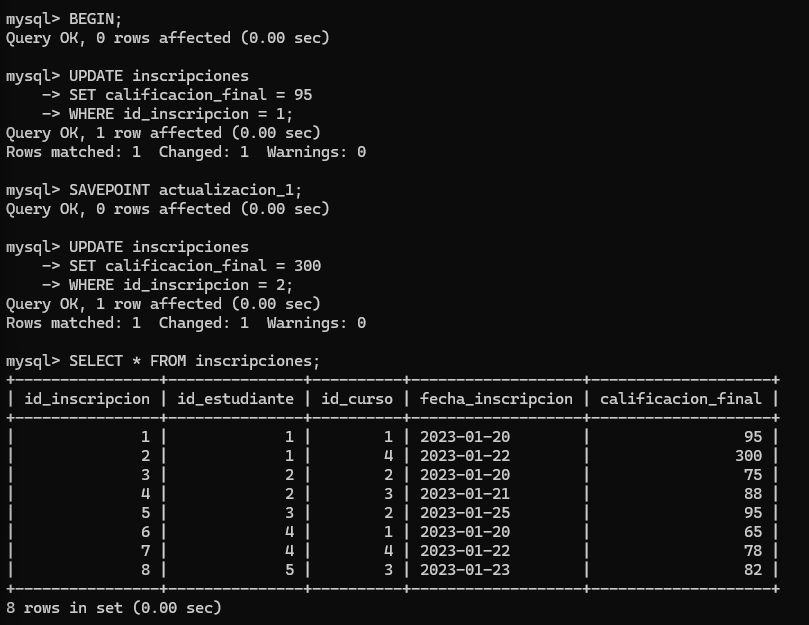

# Entrenamiento M4S2 - Sergio Cortes

## Consultas

### Obtener el listado de todos los estudiantes junto con sus inscripciones y cursos

---

### Listar los cursos dictados por docentes con más de 5 años de experiencia.

---

### Obtener el promedio de calificaciones por curso (GROUP BY + AVG).

---

### Mostrar los estudiantes que están inscritos en más de un curso (HAVING COUNT(*) > 1).

---

### Agregar una nueva columna estado_academico a la tabla estudiantes (ALTER TABLE).

---

### Eliminar un docente y observar el efecto en la tabla cursos (uso de ON DELETE en FK).

Al intentar eliminar al docente Jose no me deja debido a que la taba `cursos` tiene una llave foránea vinculada a él.

Reviso la tabla de `cursos` para saber el nombre de la llave foránea.

Elimino la llave foránea.

Intento añadir una nueva llave foránea pero agregandole `ON DELETE SET NULL` para que al eliminar el docente, en la tabla `cursos` el campo del `id_docente` cambie a `NULL`.

No me lo permite debido a que `id_docente` tiene `NOT NULL`.

Edito la columna `id_docente` para permitir valores `NULL`.

Añado la clave foránea con `ON DELETE SET NULL`.

Elimino al docente.

Reviso si alguna fila de `cursos` tiene `NULL` en `id_docente`.

---

### Consultar los cursos en los que se han inscrito más de 2 estudiantes (GROUP BY + COUNT + HAVING).

`SELECT` general para mostrar la tabla completa.

#### `HAVING COUNT(*) > 2`

### Obtener el promedio de calificaciones por estudiante (GROUP BY + AVG).

## Subconsultas

### Obtener los estudiantes cuya calificación promedio es superior al promedio general (AVG() + subconsulta).

---

### Mostrar los nombres de las carreras con estudiantes inscritos en cursos del semestre 2 o posterior (IN o EXISTS).

---

### Utiliza funciones como ROUND, SUM, MAX, MIN y COUNT para explorar distintos indicadores del sistema.

#### 1. Cantidad total de estudiantes

####  2. Cantidad de estudiantes por carrera

#### 3. Suma total de créditos inscritos por estudiante

#### 4. Promedio de calificaciones por curso (con ROUND)

#### 5. Máxima y mínima calificación obtenida por cada estudiante

#### 6. Carrera con mejor promedio de calificación

#### 7. Cantidad de cursos por semestre

## Crear una vista

## Control de acceso y transacciones

### 1. Asigna permisos de solo lectura a un rol llamado revisor_academico sobre la vista *vista_historial_academico (GRANT SELECT)*

### 2. Revoca los permisos de modificación de datos sobre la tabla inscripciones a este rol (REVOKE).

### 3. Simula una operación de actualización de calificaciones usando BEGIN, SAVEPOINT, ROLLBACK y COMMIT.

